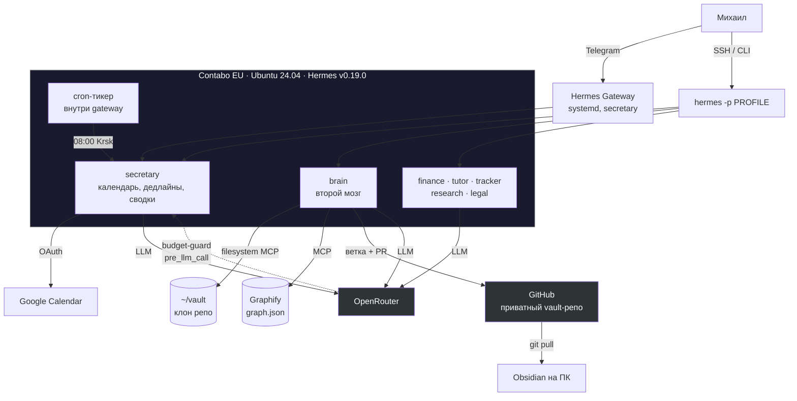

# ai-team-v2 — техническое описание проекта

Документ для технических специалистов: что построено, на чём, какие решения приняты и почему,
где границы и известные проблемы. Актуально на 2026-07-25.

---

## 1. Что это

Персональная команда ИИ-агентов для одного пользователя (владелец — Михаил, студент-фрилансер,
поступает на AI/ML в вуз Санкт-Петербурга). Не продукт и не стартап — личный инструмент,
который должен работать надёжно и дёшево.

Каждый агент — отдельная роль со своей личностью, памятью и набором инструментов: секретарь
ведёт время и календарь, второй мозг работает с базой знаний, остальные закрывают учёбу,
финансы, проекты, ресёрч и правовые вопросы.

**Ключевая особенность подхода:** это не «обёртка над чатом». Агенты живут на своём сервере,
имеют постоянную память между сессиями, проактивно пишут сами (cron), ходят во внешние API
(Google Calendar, GitHub) и работают с реальными файлами пользователя.

### Предыстория — почему v2

Первая версия (`ai-team`) писалась с нуля как самодельный Telegram-бот и **провалилась**:
агенты переставали отвечать, память терялась, оркестрация разъезжалась. Вывод, определивший
всю архитектуру v2: **не писать инфраструктуру агентов самому**. Взять зрелый фреймворк и
строить только надстройку — персоны, конфиги, хуки, интеграции.

---

## 2. Стек

| Слой | Решение | Обоснование |
|---|---|---|
| Ядро агентов | **Hermes Agent v0.19.0** (NousResearch) | Готовые профили, память, cron, MCP, гейтвеи мессенджеров, плагинная система с хуками |
| LLM-провайдер | **OpenRouter** | Единый API ко всем моделям, оплата по факту |
| Модель по умолчанию | `deepseek/deepseek-v4-flash` ($0.10 / $0.20 за 1M токенов) | Дёшево + рабочий tool-calling; апгрейд точечно там, где цена ошибки высока |
| Сервер | Contabo EU, Ubuntu 24.04 (12 ГБ RAM / 6 vCPU / 200 ГБ), €7.50/мес | Вне РФ — обязательное требование, см. ниже |
| База знаний | Obsidian vault → приватный git-репозиторий | Git тут и синхронизация, и механизм ревью |
| Граф знаний | **Graphify** (`graphifyy`), MCP-режим | Дешёвые структурные запросы вместо перечитывания файлов |
| Интеграции | Google Calendar (bundled-скилл Hermes), GitHub REST API, filesystem MCP | — |

### Схема



---

## 3. Текущее состояние

| Фаза | Что | Статус |
|---|---|---|
| 0 | Верификация возможностей Hermes по исходникам | ✅ |
| 1 | Секретарь: базовый профиль, Telegram, systemd | ✅ **работает вживую** |
| 2 | Календарь, утренняя сводка по cron, бюджет-хук | ✅ **работает вживую** |
| 3 | Второй мозг: vault, PR-запись, Graphify | ✅ **работает вживую** |
| 4 | Маркетплейсер WB/Ozon (главный бизнес-приоритет) | 📋 старт ~сентябрь |
| 5 | Офис, часть 1: Kanban — агенты передают работу друг другу | ✅ **работает вживую** |
| 5 | Офис, часть 2: гейт общего чата в Telegram | 📦 готов, не развёрнут |
| 6 | Веб-дашборд (нативный `hermes dashboard`) | 📦 runbook готов, не развёрнут |
| 7 | Пять новых ролей | ✅ **работает вживую** |
| 8 | Todoist MCP для секретаря | ✅ **работает вживую** |

**~30 коммитов**, 7 профилей (все живые), 2 собственных плагина, 1 собственный скилл,
8 пошаговых runbook'ов.

### Что реально работает прямо сейчас

- Секретарь отвечает в Telegram и CLI, ведёт Google Calendar, ставит напоминания.
- Каждое утро в 08:00 по времени владельца (Красноярск, UTC+7) по cron приходит сводка — **или не приходит**, если сказать нечего
  (агент отвечает `[SILENT]`, Hermes подавляет доставку). Это осознанный дизайн: сводка ради
  сводки обесценивает канал.
- Второй мозг читает Obsidian vault (79 файлов), отвечает по существу с цитатами,
  и **дописывает vault только через Pull Request** — ветка, коммит, push, PR через GitHub API.
- Граф знаний по vault: **420 узлов, 405 связей, 62 сообщества**. Стоимость индексации — $0.024.
- Расход на LLM за всё время разработки и тестов — **~$0.13**.

---

## 4. Реестр агентов и матрица доступов

Принцип из технического задания: **файловая система — только у второго мозга**. Каждое
отступление обосновано отдельно и задокументировано в конфиге.

| Профиль | Роль | terminal | code_exec | ФС/vault | веб-поиск |
|---|---|---|---|---|---|
| `secretary` | время, дедлайны, календарь, сводки | ⚠️ вынужденно | ❌ | ❌ | ✅ |
| `brain` | база знаний, запись через PR | ✅ заперт в vault | ❌ | ✅ MCP | ✅ |
| `tutor` | самообразование: матан, ML, алгоритмы | ❌ | ✅ обоснованно | ❌ | ✅ |
| `finance` | личные деньги | ❌ | ❌ | ❌ | ✅ |
| `tracker` | состояние проектов, открытые вопросы | ❌ | ❌ | ❌ | ✅ |
| `research` | ресёрч с источниками | ❌ | ❌ | ❌ | ✅ |
| `legal` | право фрилансера | ❌ | ❌ | ❌ | ✅ |

**Про два отступления:**

- **`secretary` + terminal** — не по желанию, а по необходимости: bundled-скилл Google Workspace
  в Hermes v0.19.0 **не имеет отдельного инструмента для календаря**. Все операции, включая сам
  OAuth-setup и каждый вызов `calendar list`, идут shell-командой `python google_api.py ...`.
  Без терминала календарь не работает в принципе. Hermes не умеет ограничивать terminal
  списком разрешённых команд, поэтому смягчение — `approvals.mode: manual` (подтверждение на
  разрушительные команды) плюс явный запрет в персоне использовать shell вне календаря.
- **`tutor` + code_execution** — проверять решение алгоритма запуском, а не «на глаз», это
  суть роли. Терминал при этом не даётся: код исполняется, но бродить по серверу нельзя.

**`brain` и terminal:** терминал нужен для git-операций, но рабочая директория жёстко заперта
на клон vault через `terminal.cwd` — за его пределы агент физически не выйдет.

---

## 5. Собственный код

Всё написанное держится на официальных точках расширения Hermes (плагины, хуки, скиллы,
профили). **Ядро фреймворка не патчится** — это осознанное требование: `hermes update`
не должен ломать надстройку.

### `plugins/budget-guard` — мягкий контроль расхода
Хук `pre_llm_call`. Раз в 15 минут дёргает `GET /api/v1/credits` у OpenRouter; если остаток
ниже порога — дописывает предупреждение в контекст хода.

Ключевое свойство: **не может заблокировать запрос архитектурно**. `pre_llm_call` не умеет
прерывать ход — только добавлять контекст. Это соответствует требованию «мягкий лимит,
предупредить, а не рубить»: решение о деньгах всегда за владельцем. Предупреждает один раз
за период низкого баланса, а не на каждом ходу. Любая ошибка (нет сети, поменялся формат
ответа API) — молча пропускается, хук не должен ронять агента.

### `plugins/office-gate` — гейт группового чата
Хук `pre_gateway_dispatch`. В общем чате офиса каждый агент решает **сам за себя**, должен
ли он отвечать — общего арбитра нет по дизайну (требование брифа «без куратора»). Порядок
проверок выстроен так, чтобы дешёвые случаи не доходили до модели:

1. личка — пропускаем всегда;
2. ответ на своё же сообщение — пропускаем;
3. **позвали по имени** — отвечаем, без вызова модели;
4. **позвали другого** — молчим, тоже без вызова модели;
5. иначе — один дешёвый классифицирующий запрос против описания роли из `profile.yaml`
   (того же, по которому Kanban маршрутизирует задачи — одна формулировка на два механизма).

Распознавание имён устроено под русский: профили названы по-английски (`secretary`,
`legal`), а обращаются к ним по-русски и со склонениями. Поэтому сверка идёт по основам
слов с ограничением на длину окончания — падежные окончания короткие («секретар|ю»,
«юрист|а»), а производные прилагательные длиннее. Ограничение появилось не из теории:
тест поймал, что основа «мозг» срабатывает на «мозговой штурм».

**Failure mode выбран в сторону «пропустить, а не промолчать»**: любая ошибка → агент
запускается как обычно. Причина прямая — «агенты молчат» было главной болезнью первой
версии проекта, и воспроизводить её через собственный гейт нельзя.

Логика имён покрыта тестом без зависимостей: `python3 plugins/office-gate/test_mentions.py`
(20 кейсов, включая негативные). Поведение классификатора на живых сообщениях тестом не
покрыть — это калибруется на реальном чате.

### `profiles/brain/skills/vault-pr-write` — запись в vault только через PR
Скилл поверх встроенного `obsidian`-скилла: описывает git-последовательность
(ветка → коммит → push → PR через `curl` к GitHub API → отдать ссылку, не мержить самому).

---

## 6. Ключевые решения и обоснования

**Геоблокировка определила инфраструктуру.** OpenRouter и большинство зарубежных
LLM-провайдеров отдают `403` на российские IP. Проверяется мгновенно голым `curl`. Отсюда —
сервер вне РФ (Contabo EU). Российские реселлеры проверялись и отпали: у одного оказался
сломан стриминг, у другого — нестандартное расположение API-ключа, ломавшее авторизацию.

**Cloud.ru рассматривался и отклонён.** Российский сервис с OpenAI-совместимым API и оплатой
в рублях выглядел решением проблемы геоблока. Отклонён по цене: **та же самая** DeepSeek-V4-Pro
стоит там ~183 ₽ / 732 ₽ за 1M токенов против ~$0.435 / $0.87 (~35 ₽ / 70 ₽) на OpenRouter —
разница в 5-10 раз. Вывод: дешевле держать сервер за границей.

**Маркетплейс пойдёт через РФ-прокси, а не переездом стека.** Seller API WB/Ozon может
блокировать EU-адреса. Вместо переноса всей системы в Россию (что означало бы дорогой Cloud.ru
или потерю OpenRouter) — маленький российский VPS как прокси только для маркетплейс-трафика.
LLM-запросы продолжают уходить с EU-сервера.

**Vault в git, а не просто папка.** Git здесь решает две задачи сразу: синхронизацию между
ПК владельца (Obsidian) и сервером (агент), и ревью изменений через PR-диффы. Альтернатива
(папка + Syncthing) проще в настройке, но теряет дифф-ревью правок и off-site бэкап.

**Веб-дашборд не пишем свой.** Изначально планировался фронт на Next.js поверх API. При
обновлении знаний до v0.19.0 выяснилось, что Hermes уже включает полноценный дашборд
(чат = TUI в браузере, переключатель профилей, Kanban, аналитика расхода, логи). Своя
разработка отменена — меньше кода, меньше поверхности для поломки при обновлениях.

**Дешёвая модель по умолчанию, апгрейд точечно.** `deepseek-v4-flash` на всех ролях, но в
конфигах `tutor` и `legal` явно отмечено, что это первые кандидаты на замену: неверное
объяснение математики закрепляется в голове, а выдуманный номер статьи закона выглядит
убедительно и на него сошлются. Экономия на этих двух ролях — ложная.

---

## 7. Подводные камни (найдены на практике)

Самая полезная часть для тех, кто будет делать похожее.

| Проблема | Причина | Решение |
|---|---|---|
| Cron стрелял не в то время, агент путался в «UTC+7 / CEST» | Без явного ключа `timezone:` Hermes берёт **системную зону сервера**, а не зону пользователя | `timezone: <зона ПОЛЬЗОВАТЕЛЯ>` в конфиге профиля — и именно спросить её, а не вывести: сначала стояла Europe/Moscow «раз переезжает в Петербург», а Михаил живёт в Красноярске (UTC+7), сводка приходила на 5 часов позже |
| `cron create "every 1d at 08:00"` падает | Парсер понимает `30m`, `every 2h` и cron-выражения, но **не** «at HH:MM» | `"0 8 * * *"` |
| Cron-задача есть, `next_run_at` идёт, но не срабатывает | Cron-тикер живёт **внутри gateway**, не отдельным процессом | Держать gateway запущенным |
| Сообщения из cron приходят в служебной обёртке `Cronjob Response: ... (job_id: ...)` | Обёртка включена по умолчанию | `cron.wrap_response: false` |
| Агент не видит переменную из `.env`, хотя она там есть | Переменные читаются **при старте процесса**; новый диалог внутри той же сессии не перечитывает `.env` | Полный рестарт процесса агента |
| `graphify extract --backend openai` падает с «openai package is required» | Провайдеры и MCP — опциональные extras пакета | `uv tool install "graphifyy[openai,mcp]"` |
| Graphify уходит в бесконечное дробление чанков | `deepseek-v4-flash` упирается в лимит вывода и обрывает JSON | `GRAPHIFY_MAX_OUTPUT_TOKENS=16384` + `--token-budget 4000` |
| `python -m graphify.serve` не находит модуль | У Graphify **нет** подкоманды `serve`, и он ставится в изолированное окружение | `uv tool run --from graphifyy python -m graphify.serve <graph.json>` |
| Gateway не рестартится: «linger is not enabled» | На headless-сервере user-level systemd-сервисы умирают без linger | `sudo loginctl enable-linger <user>` |
| Тулсет `kanban` включён, но инструментов `kanban_*` в сессии нет | Убрать из `disabled_toolsets` недостаточно: `check_fn` требует, чтобы профиль явно перечислил `kanban` в верхнеуровневом ключе `toolsets` | Держать обе настройки: убрать из `disabled_toolsets` **и** добавить `toolsets: [hermes-cli, kanban]` |
| Branch protection на приватном репо не работает | На бесплатном GitHub правила защиты веток не применяются к приватным репозиториям | Принято как есть: PR-дисциплина держится на инструкции агенту, git всё равно даёт полную историю и откат |
| Долгая индексация обрывается вместе с SSH | — | `tmux` |

---

## 8. Известные ограничения и риски

Честно, без приукрашивания:

1. **Классификатор `office-gate` не калиброван.** Контракт хука сверен с исходниками
   v0.19.0, распознавание обращений покрыто тестами — но как поведёт себя LLM-классификатор
   на живых сообщениях, заранее не известно. Ожидаемые режимы отказа: на пограничное
   сообщение отвечают двое (общего арбитра нет by design), либо классификатор слишком строг
   и молчат все. Второе хуже, поэтому при любой внутренней ошибке хук пропускает.
2. **Запись в vault защищена только инструкцией.** Технического барьера нет (см. подводные
   камни про GitHub). Если агент отклонится от скилла — прямой push в `main` пройдёт.
   Смягчение: git не удаляет историю, любое изменение видно и откатывается.
3. **Секретарь имеет полный shell.** Вынужденно, ради календаря. Ограничен только текстовой
   инструкцией в персоне и подтверждением разрушительных команд.
4. **Точность на дешёвой модели не измерена систематически.** Особенно у `tutor` (математика)
   и `legal` (нормы права). Есть план апгрейда, нет метрик.
5. **13 файлов vault не попали в граф** при индексации — модель их пропустила. Не блокирует
   (файлы читаются обычным способом), лечится повторным прогоном.
6. **Единая точка отказа — один VPS.** Бэкапов конфигов вне git пока нет.
7. **Секрет один раз попал в контекст модели** — владелец вставил GitHub-токен прямо в чат
   агенту. Практика исправлена (секреты вводятся на сервере), но токен стоит ротировать.

---

## 9. Разделение труда в разработке

Проект строится в связке «ИИ-инженер + владелец», и это влияет на форму артефактов:

| ИИ-инженер (в репозитории) | Владелец (на сервере) |
|---|---|
| Персоны, конфиги профилей | Выполнение команд |
| Код плагинов и хуков, скиллы | Ввод ключей и токенов, создание ботов |
| Пошаговые runbook'и на каждую фазу | Клики в веб-кабинетах, оплата |
| Проверка API по исходникам фреймворка | **Живой тест и отладка** |

Отсюда — упор на runbook'и: каждая фаза оформлена как «скопировал → запустил → проверил»,
с явной пометкой, какие шаги проверены по исходникам, а какие остаются черновиком под
живую проверку. Все находки из отладки возвращаются в runbook'и коммитами (см. историю:
значительная часть коммитов — именно исправления инструкций по факту живых ошибок).

---

## 10. Структура репозитория

```
docs/
├── project-overview.md        # этот файл
├── roadmap.md                 # цели, фазы, критерии готовности
├── phase-0-verification.md    # что умеет Hermes — проверка по исходникам
└── phase-{1,2,3,5,6,7}-runbook.md   # пошаговые инструкции по фазам

profiles/                      # версионируемая часть агентов (без секретов)
├── secretary/  SOUL.md · MORNING.md · config.yaml
├── brain/      SOUL.md · config.yaml · skills/vault-pr-write/SKILL.md
└── finance · tutor · tracker · research · legal   (SOUL.md + config.yaml)

plugins/
├── budget-guard/              # хук pre_llm_call
└── office-gate/               # хук pre_gateway_dispatch + тест распознавания имён
```

Секреты в git не хранятся — только `.env.example` шаблоны. `SOUL.md` — персона агента
(роль, поведение, границы), `config.yaml` — модель, таймзона, отключённые наборы
инструментов, MCP-серверы.

---

## 11. Что дальше

**Ближайшее:** офис (Kanban + гейт группового чата, фаза 5) → веб-дашборд (фаза 6). Пять
новых ролей и Todoist у секретаря уже развёрнуты и работают.

**Главная цель бизнеса:** агент-маркетплейсер для WB/Ozon (~сентябрь) — чтение заказов,
остатков и цен, предложение действий, выполнение **только по явному подтверждению**.
Технически ключевой вопрос — доступность Seller API с EU-адреса; при блокировке поднимается
российский прокси только под этот трафик.

**Бюджетная рамка всего стека:** ~3000 ₽/мес, из них сервер €7.50 и LLM по факту
потребления (текущий расход — доли доллара в месяц).
